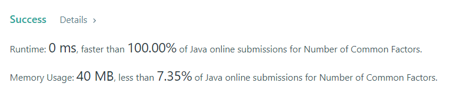

# Number of Common Factors

### Task:

Given two positive integers a and b, return the number of common factors of a and b.
An integer x is a common factor of a and b if x divides both a and b.

### Example 1:

Input: a = 12, b = 6
Output: 4
Explanation: The common factors of 12 and 6 are 1, 2, 3, 6.

### Result:

The time complexity of this algorithm is O(N). And the same algorithm for memory.
